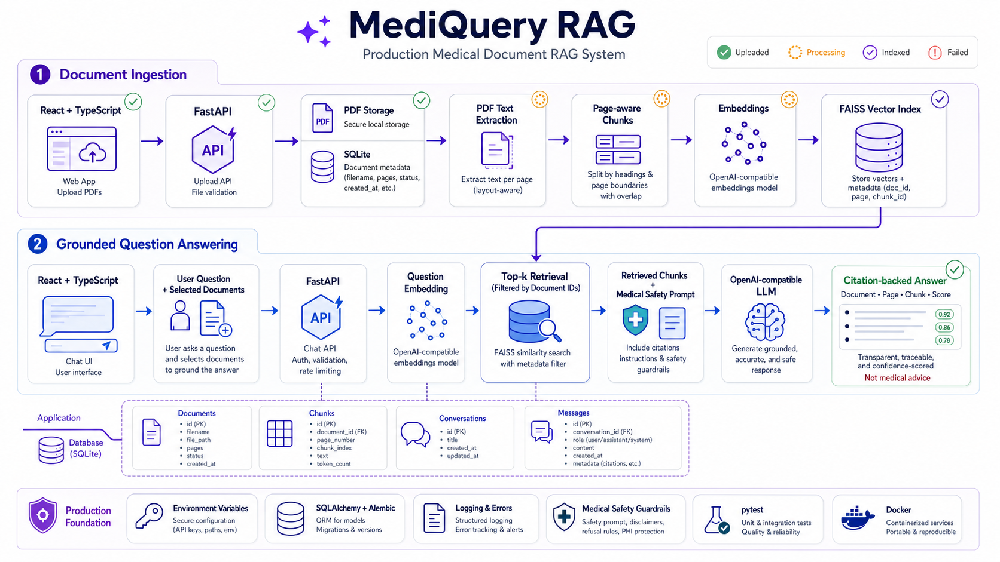

# MediQuery RAG

MediQuery RAG is a production-oriented medical document question-answering workspace. Users upload trusted PDFs, select the sources they want to search, and receive grounded answers with document, page, chunk, and relevance citations.

> Medical safety: MediQuery is an information-retrieval tool, not a doctor. Its output does not replace professional diagnosis, treatment, or emergency care.

## Architecture



The visual follows two paths:

1. **Ingestion:** React upload → FastAPI validation → local PDF storage + SQLite metadata → page-aware text extraction → chunking → embeddings → FAISS.
2. **Question answering:** selected documents + question → question embedding → filtered FAISS retrieval → medical safety prompt → OpenAI-compatible LLM → citation-backed response.

The architecture image was generated for this project with the built-in image generation workflow using an `infographic-diagram` production architecture prompt.

## Current delivery

The React frontend is connected directly to the complete FastAPI RAG backend.

- Responsive overview dashboard and system health
- Drag-and-drop PDF upload with validation and progress
- Searchable, filterable document library with statuses
- Grounded chat UI with document selection, citations, and source preview
- Backend-only API-key guidance in settings
- Loading, empty, validation, success, and error states
- React Router, TanStack Query, Axios, Tailwind CSS, TypeScript
- FastAPI, SQLAlchemy, SQLite, LangChain, PyMuPDF, FAISS, and OpenAI-compatible clients
- Page-aware ingestion, normalized cosine retrieval, citations, conversations, and safety notices

## Run locally

```bash
cd frontend
copy .env.example .env
npm install
npm run dev
```

Open `http://localhost:5173`.

Start the backend in a second terminal:

```powershell
cd backend
python -m venv .venv
.venv\Scripts\activate
pip install -r requirements.txt
Copy-Item .env.example .env
uvicorn app.main:app --reload
```

Configure the four provider variables in `backend/.env`. The frontend reads the backend URL from `VITE_API_BASE_URL`.

Production checks:

```bash
npm run lint
npm run build
npm run preview
```

`VITE_API_BASE_URL` is the only frontend API origin setting. All dashboard, document, upload, conversation, health, and chat data comes from FastAPI.

## Frontend structure

```text
frontend/src/
├── api/                 Axios client and typed API functions
├── components/
│   ├── chat/            Citation presentation
│   ├── documents/       Dropzone and reusable document rows
│   ├── layout/          Sidebar, mobile header, app shell
│   └── ui/              Brand, badges, headers, loading states
├── pages/               Route-level dashboard, upload, chat, library, settings
├── types/               Shared document and chat contracts
├── App.tsx              Route map
├── index.css            Tailwind layers and design-system primitives
└── main.tsx             React and TanStack Query bootstrap
```

## Files to understand first

1. `frontend/src/App.tsx` — the route-level shape of the product.
2. `frontend/src/components/layout/AppShell.tsx` — shared application layout.
3. `frontend/src/api/client.ts` — provider-independent API boundary and environment configuration.
4. `frontend/src/api/documents.ts` — upload, list, detail, stats, and delete API flow.
5. `frontend/src/pages/ChatPage.tsx` — selected-document state, message lifecycle, and citation rendering.
6. `frontend/src/types/chat.ts` and `document.ts` — contracts the backend must satisfy.

## Backend contract

| Method | Route | Purpose |
|---|---|---|
| `GET` | `/health` | Service health |
| `GET` | `/api/documents` | List indexed and in-progress documents |
| `POST` | `/api/documents/upload` | Validate and ingest a PDF |
| `GET` | `/api/documents/{id}` | Document metadata and chunk summary |
| `DELETE` | `/api/documents/{id}` | Remove file, metadata, and vectors |
| `POST` | `/api/chat` | Retrieve context and return a cited answer |
| `GET` | `/api/conversations` | List recent chats |
| `DELETE` | `/api/conversations/{id}` | Delete a chat and its messages |

## Security boundary

Only `VITE_API_BASE_URL` and non-secret UI flags belong in frontend environment files. `OPENAI_API_KEY`, `OPENAI_BASE_URL`, `CHAT_MODEL`, and `EMBEDDING_MODEL` must exist only in the backend environment.

See [`backend/README.md`](backend/README.md) for the complete upload flow, RAG internals, file-by-file learning path, tests, evaluation harness, safety design, and PostgreSQL/pgvector migration plan.
