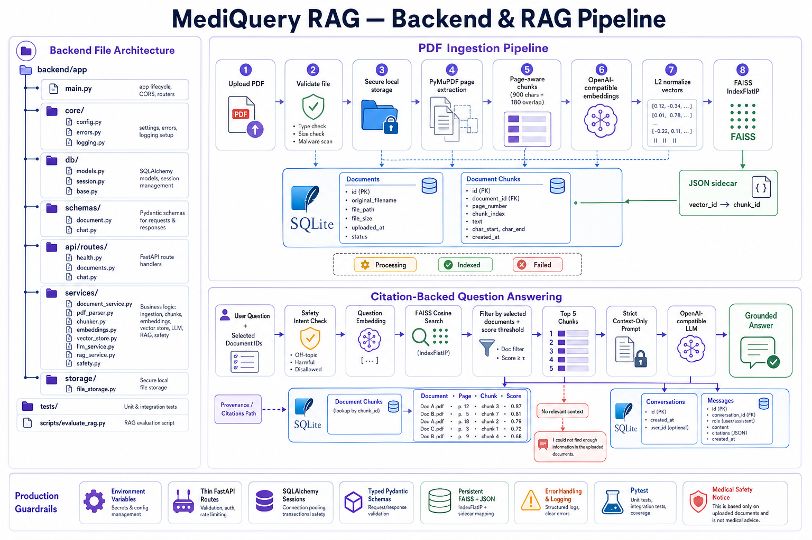

# MediQuery RAG backend

FastAPI service for medical PDF ingestion and citation-backed question answering. FastAPI routes, Pydantic response contracts, SQLAlchemy models, and the React API contract remain unchanged; LangChain now implements the RAG components behind that boundary.



## Architecture

```text
PDF upload
  -> file signature/MIME/size validation
  -> collision-safe local storage
  -> LangChain PyMuPDFLoader (one Document per page)
  -> RecursiveCharacterTextSplitter (900 chars, 180 overlap)
  -> SQLite document_chunks rows receive stable IDs
  -> OpenAIEmbeddings through the configured compatible endpoint
  -> LangChain FAISS stores text + SQLite IDs + citation metadata
  -> native FAISS index and safe JSON docstore persisted atomically

Question + selected document IDs
  -> deterministic medical safety assessment
  -> LangChain FAISS similarity_search_with_score
  -> metadata filter to selected document IDs
  -> resolve returned chunk IDs through SQLite
  -> ChatPromptTemplate formats context-only medical rules
  -> ChatOpenAI invocation at temperature zero
  -> answer + SQLite-backed citations + safety notice + conversation history
```

## Why LangChain is used

LangChain provides consistent interfaces for loading, splitting, embedding, retrieval, prompts, and chat models. That makes the provider and vector-store layers replaceable while MediQuery keeps its own explicit transactions, medical guardrails, citations, and API schemas.

- `PyMuPDFLoader` produces standard LangChain `Document` objects with page metadata.
- `RecursiveCharacterTextSplitter` keeps paragraphs and sentences together where possible while enforcing bounded overlapping chunks.
- `OpenAIEmbeddings` uses `EMBEDDING_MODEL`, `OPENAI_API_KEY`, and the optional OpenAI-compatible `OPENAI_BASE_URL`.
- Community `FAISS` embeds, stores, metadata-filters, and searches LangChain Documents.
- `ChatPromptTemplate` separates immutable medical rules from retrieved context and the user question.
- `ChatOpenAI` invokes `CHAT_MODEL` through the same OpenAI-compatible configuration.

MediQuery intentionally does not hide everything inside an opaque one-call chain. `LangChainRAGService` keeps retrieval, SQLite validation, prompt formatting, invocation, citations, and safety as visible steps. This is easier to test, debug, and explain.

## Setup

```powershell
cd backend
python -m venv .venv
.venv\Scripts\activate
pip install -r requirements.txt
Copy-Item .env.example .env
uvicorn app.main:app --reload
```

Swagger is available at `http://localhost:8000/docs` and ReDoc at `http://localhost:8000/redoc`.

```powershell
.venv\Scripts\python.exe -m pytest
```

## Environment variables

| Variable | Purpose |
|---|---|
| `DATABASE_URL` | SQLAlchemy connection string |
| `UPLOAD_DIR` | Private PDF storage directory |
| `FAISS_INDEX_PATH` | Native FAISS index file |
| `FAISS_METADATA_PATH` | Safe JSON LangChain docstore and index mapping |
| `FRONTEND_ORIGIN` | Allowed CORS origin(s) |
| `OPENAI_API_KEY` | Backend-only provider credential |
| `OPENAI_BASE_URL` | Optional OpenAI-compatible base URL |
| `CHAT_MODEL` | Model passed to `ChatOpenAI` |
| `EMBEDDING_MODEL` | Model passed to `OpenAIEmbeddings` |
| `CHUNK_SIZE` / `CHUNK_OVERLAP` | Recursive splitter controls |
| `RETRIEVAL_TOP_K` | Maximum retrieved citations |
| `RETRIEVAL_SCORE_THRESHOLD` | Minimum converted cosine score |

No provider secrets are exposed to the frontend.

## Unchanged API routes

| Method | Route | Description |
|---|---|---|
| `GET` | `/health` | Liveness response |
| `GET` | `/api/documents` | List document states |
| `POST` | `/api/documents/upload` | Validate, load, split, embed, and index a PDF |
| `GET` | `/api/documents/{id}` | Metadata and chunk previews |
| `DELETE` | `/api/documents/{id}` | Delete rows/file and rebuild LangChain FAISS |
| `POST` | `/api/chat` | Return grounded answer, citations, notice, conversation ID |
| `GET` | `/api/conversations` | List recent chat conversations |
| `DELETE` | `/api/conversations/{id}` | Delete a conversation and its messages |

The existing `/api/dashboard/stats` frontend-support route also remains unchanged.

## Important files

```text
app/
|-- main.py                              lifecycle, CORS, routers, legacy-index migration
|-- core/config.py                       typed environment settings
|-- db/models.py                         unchanged SQLAlchemy tables
|-- schemas/                             unchanged frontend contracts
|-- api/routes/                          unchanged thin route handlers
|-- services/document_service.py         ingestion and deletion transactions
|-- services/langchain_loader.py         PyMuPDFLoader adapter
|-- services/langchain_chunker.py        RecursiveCharacterTextSplitter adapter
|-- services/langchain_vector_store.py   OpenAIEmbeddings + persistent FAISS
|-- services/langchain_rag_service.py    retrieval + prompt + ChatOpenAI + citations
|-- services/safety.py                    deterministic high-risk detection
`-- storage/file_storage.py              validation and local file lifecycle
```

Study `db/models.py`, `document_service.py`, `langchain_vector_store.py`, and `langchain_rag_service.py` first.

## PDF upload flow

1. `file_storage.py` validates `.pdf`, MIME type, `%PDF-` signature, and the streaming 50 MB limit.
2. `document_service.py` creates a durable `processing` row.
3. `LangChainPDFLoader` runs `PyMuPDFLoader` in page mode and normalizes one-based page numbers.
4. `LangChainChunker` passes those page Documents to `RecursiveCharacterTextSplitter`. Metadata is copied into every split, and MediQuery adds a global `chunk_index`.
5. Chunk text, page number, and index are inserted into the unchanged SQLite `document_chunks` table and flushed to obtain primary keys.
6. The SQLite `chunk_id`, `document_id`, filename, page, and chunk index are placed into each LangChain Document's metadata.
7. `OpenAIEmbeddings` embeds the Documents and LangChain FAISS adds them using string versions of SQLite chunk IDs as docstore IDs.
8. MediQuery records each FAISS position in the existing `vector_id` column, persists the native index plus JSON docstore, and marks the document `indexed`.

The startup lifecycle can migrate the earlier raw FAISS + `vector_to_chunk` JSON format into the LangChain docstore format without requesting new embeddings.

## Question-answering flow

1. The unchanged request schema validates the question and selected IDs.
2. `safety.py` detects high-risk intent independently from the model.
3. LangChain FAISS embeds the question through the same `OpenAIEmbeddings` object.
4. `similarity_search_with_score` searches normalized vectors and filters LangChain metadata to the selected documents.
5. Squared L2 distance is converted to cosine similarity. Weak results are rejected by `RETRIEVAL_SCORE_THRESHOLD`.
6. Returned `chunk_id` values are resolved through SQLite; stale or missing rows cannot become citations.
7. `ChatPromptTemplate` formats source-labelled context, the question, strict medical rules, and any deterministic safety instruction.
8. `ChatOpenAI` is configured lazily with `model`, `api_key`, `base_url`, temperature zero, and retry limits.
9. Citation filename, page, chunk text, index, and score come from retrieved SQLite rows—not model-generated metadata.
10. The unchanged response contains `answer`, `conversation_id`, `citations`, and `safety_notice`; messages are saved to the unchanged conversation tables.

If nothing passes retrieval and SQLite validation, the LLM is not called and the exact fallback is returned: “I could not find enough information in the uploaded documents.”

## Medical safety and hallucination controls

- Context-only system prompt and temperature zero
- Selected-document metadata filtering
- Similarity threshold and deterministic insufficient-context response
- Citations built from SQLite rather than model text
- High-risk keyword assessment outside the LLM
- Deterministic professional-care warning for risky questions
- Not-medical-advice notice enforced on every generated answer

These measures reduce risk but cannot make an LLM a medical professional or guarantee correctness.

## Evaluation

```powershell
.venv\Scripts\python.exe scripts\evaluate_rag.py --document-ids 1 2
```

The script prints questions, latency, answers, citation presence, retrieved pages/chunks, scores, and previews.

## PostgreSQL + pgvector migration

1. Change `DATABASE_URL` and add a migration for a pgvector embedding column.
2. Replace `LangChainFAISSVectorStore` with a pgvector-backed LangChain integration or repository.
3. Filter `document_id` inside the vector SQL query and use an HNSW/IVFFlat index after measuring recall.
4. Backfill current chunk embeddings, then remove the FAISS index and JSON docstore.

Routes, schemas, safety logic, conversation storage, and most of `LangChainRAGService` can remain unchanged.

## Future improvements

- PostgreSQL/pgvector or Qdrant
- Redis/Celery background ingestion
- Authentication and per-user isolation
- Hybrid BM25 + vector retrieval and reranking
- OCR for scanned PDFs
- RAGAS regression evaluation
- Malware scanning, encrypted object storage, rate limiting, and audit logs
- Docker/VPS deployment with reverse proxy and TLS
